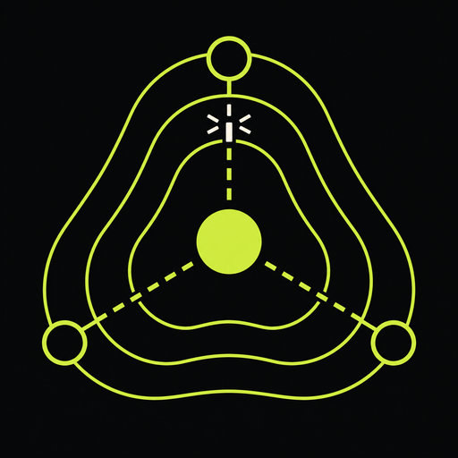

# Air-Mesh

<p align="center">
  
</p>

<p align="center"><strong>Offline-first peer-to-peer messaging and rescue coordination.</strong></p>

<p align="center">
  <a href="https://github.com/alham-rizvi/Air-mesh/actions/workflows/android-release.yml"></a>
  <a href="https://github.com/alham-rizvi/Air-mesh/releases"></a>
</p>

Air-Mesh is a React Native and Expo application for situations where ordinary connectivity is unreliable or unavailable. It keeps local identity, conversations, rescue reports, audit events, themes, and queued actions on the device. It is explicit about transport state: the app does not present mock peers as live connections.

> **Android release:** [Download the APK from GitHub Releases](https://github.com/alham-rizvi/Air-mesh/releases). Release builds are produced by GitHub Actions.

## What is included

| Area | Included capability |
|---|---|
| Local identity | Offline account creation, device detection, identity QR, local logout/reset |
| Messaging | Local direct chats, groups, queued messages, relay metadata, SOS actions |
| Rescue coordination | Shelter reports, courier sync states, severity/needs capture, report filters |
| Mesh foundation | BLE service boundary, 512-byte chunking, deduplication, TTL routing, routing-table helpers |
| Security boundary | AES-256-GCM/X25519 interfaces, contact pairing, local audit logging, SQLite schema |
| Android | Generated `android/` project, manifest permissions, Expo Dev Client/BLE boundary, release workflow |
| Help and UX | Light/dark mode, selectable accents, expandable FAQ, permission guidance, honest empty/error states |
| Base camp | Rust/Axum server, SQLite persistence, mock/Ollama prioritization, API-backed dashboard |

## Quick start

```bash
pnpm install
pnpm dev
```

Create a local identity first; no email, password, or internet connection is required for the local UI foundation. For deterministic verification, run:

```bash
pnpm verify:all
```

The verifier runs TypeScript, lint, Vitest, Android environment checks, Gradle wrapper validation, Rust formatting/tests, and the Rust build. It intentionally does not compile an APK inside the sandbox.

## Android development and release

The native project is committed under `android/`, including `android/app/src/main/AndroidManifest.xml`, Kotlin entry points, Gradle configuration, and generated resources. The manifest and Expo configuration declare Bluetooth scan/connect, nearby Wi-Fi, microphone, and notification boundaries as applicable to the native build.

Use a physical Android device for BLE and runtime permission validation. The release workflow installs its own Android SDK on GitHub Actions, regenerates native configuration, builds `app-release.apk`, and attaches it to a GitHub Release. Run it manually from a configured GitHub checkout with:

```bash
gh workflow run android-release.yml --repo alham-rizvi/Air-mesh --ref main
```

You can also push a semantic tag such as `v0.4.0` to trigger a release build.

## Repository map

```text
app/                    Expo Router screens and the main Air-Mesh UI
components/             Shared mobile UI primitives
lib/                    Zustand stores, theme, and app helpers
mobile/src/services/     Database, crypto, audit, mesh, and integration services
mobile/src/types/        Shared security and domain types
base-laptop/             Rust base-camp server and dashboard
android/                 Committed native Android project
assets/images/           App logo, splash, favicon, adaptive icons, topology visual
docs/                    Architecture, testing, release, FAQ, and development plans
scripts/                 Reproducible diagnostics and verification commands
tests/                  Deterministic Vitest coverage
.github/workflows/       Android release automation
```

## Base camp server

The Rust base camp lives in `base-laptop/` and supports deterministic mock-AI prioritization:

```bash
cd base-laptop
cargo fmt --check
MOCK_AI=1 cargo test
MOCK_AI=1 cargo run
```

The server persists reports, audit entries, and prioritized actions in SQLite and serves a truthful dashboard with live API-backed empty states. See [`base-laptop/README.md`](base-laptop/README.md) for endpoint and configuration details.

## Testing and device acceptance

The project verifies frontend compilation, linting, state, database, encryption, audit, integration, and mesh protocol behavior. The complete command is `pnpm verify:all`.

The published APK should be installed on two or more Android devices for final acceptance. Validate onboarding, permission grant/denial, theme switching, logout, audit history, manual contact pairing, direct-chat creation, group creation, SOS queuing, report creation, courier sync, and BLE discovery.

## Privacy and limitations

Air-Mesh stores the local UI and security foundation on the device. The native crypto boundary is designed for secure adapters, while web/Vitest fallbacks are intentionally non-production mocks. Live BLE discovery, advertising, relay behavior, camera QR scanning, voice capture, and Wi-Fi Direct interoperability require a native build and physical-device testing.

The app does not claim successful delivery when no transport is connected. Local messages, reports, and SOS events remain labeled as local or queued until a supported transport accepts them.

## Documentation

- [`docs/full-development-verification-plan.md`](docs/full-development-verification-plan.md) — complete development and acceptance plan.
- [`docs/architecture.md`](docs/architecture.md) — frontend, service, security, transport, and base-camp boundaries.
- [`docs/testing.md`](docs/testing.md) — automated and device test guidance.
- [`docs/release.md`](docs/release.md) — Android environment and GitHub release instructions.
- [`docs/debug-preview-findings.md`](docs/debug-preview-findings.md) — preview smoke-check notes and limitations.
- [`docs/web-assets.md`](docs/web-assets.md) — local visual assets and attribution notes.

## License

This repository is prepared for the Air-Mesh project. Review dependency licenses and add a project license before public redistribution.
